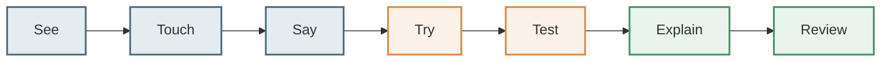

# The Learning Science Model

Every concept inside the Open Mathematics Foundation framework is built using a structured, evidence-based learning grammar. This grammar maps cognitive load and motor movement to numerical understanding.

---

## ➔ The Core Progression Grammar

### 1. See (Visual / Pictorial Anchor)
The child starts by observing a clean, non-cluttered representation of the mathematical idea. E.g., showing a ten-frame grid or an empty basket next to an orchard of apples.

### 2. Touch (Concrete / Motor Action)
The child physically interacts with the items using a mouse, keyboard, or finger on a touchscreen. Clicking a ten-frame slot, dragging apples, or tapping a slider point links muscle movement to counting sequences.

### 3. Say (Verbal Recital)
The interactive activities prompt the parent/educator to make the child count aloud: *"Put 5 apples in the basket and count them aloud."* This recruits the auditory pathway to reinforce numeric cardinality.

### 4. Try (Practice & Sandbox)
In **Practice Mode**, the child works through challenges with low stakes:
- Unlimited retries are allowed.
- Incorrect answers trigger a gentle card shake and a visual cue.
- A "💡 Tip" button provides visual support (e.g. *"Try filling the top row of the ten-frame first"*).

### 5. Test (Mastery Check)
In **Test Mode**, the child completes a short, randomized assessment without hints or immediate check feedbacks. A score of 8/10 or higher locks in a permanent **Mastery Badge** in local browser storage.

### 6. Explain (Reasoning Prompts)
Every parent guide contains conversational prompt tags. E.g., *"How do you know there are 6?"* or *"Can you show me 5 in a different arrangement?"* This prompts the child to explain their mathematical reasoning, moving them from rote computation to deep conceptual understanding.

### 7. Review (Spaced Repetition)
The Parent Dashboard highlights completed cards and identifies exact logged **Mistake Patterns** (e.g. undercounts, digit reversals), telling parents which off-screen games to replay before stepping forward.
